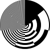
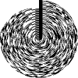

# Circle binary

A visualization of number sequences as binary circles, starting from the center growing outward. 

The idea came to me when I was trying to sleep one night and had to test what it would look like, curious to see what patterns would emerge in famous number sequences. *(If this visualization already exist and has a name, please send me a message or create an issue because im curious to know)*

The script generates svg files from a number sequence. See the example below for the result.

### Whole numbers (0-100)

### First hundred prime numbers

### First hundred fibonacci numbers 

## License
Feel free to use all code written by me however you want. The [sector.js](src/sector.js) file is taken from a tutorial repository by [marianc000](https://github.com/marianc000/pieChart) and does sadly not have a license I can cite here. 